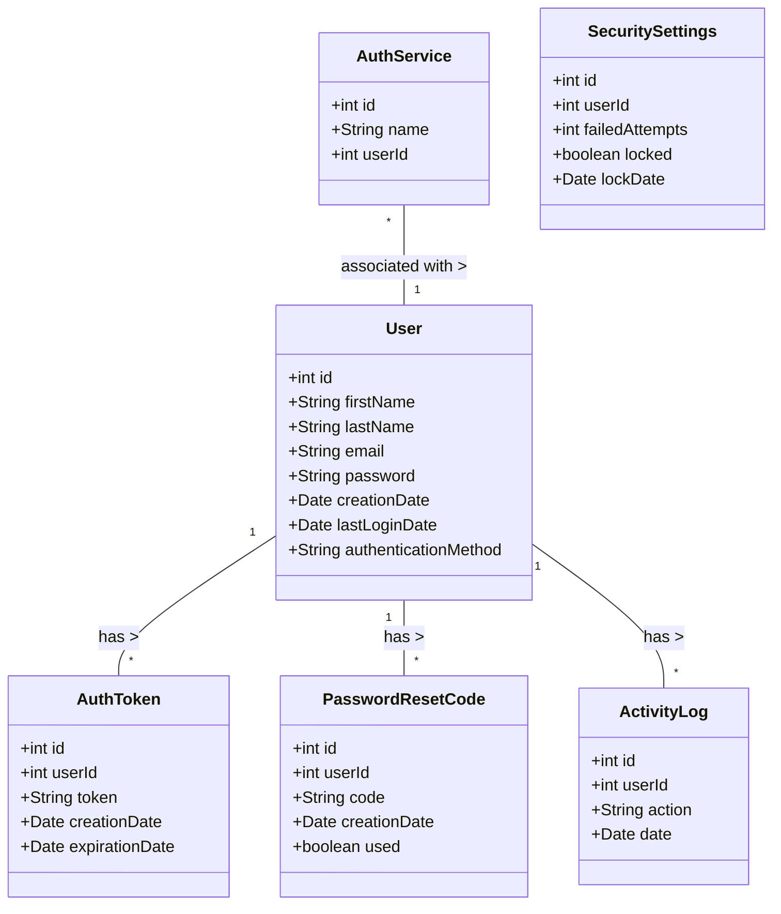

#Class Diagram

```mermaid 
classDiagram 
    class User { 
        +int id 
        +String firstName 
        +String lastName 
        +String email 
        +String password 
        +Date creationDate 
        +Date lastLoginDate 
        +String authenticationMethod 
    } 

    class AuthToken { 
        +int id 
        +int userId 
        +String token 
        +Date creationDate 
        +Date expirationDate 
    } 

    class PasswordResetCode { 
        +int id 
        +int userId 
        +String code 
        +Date creationDate 
        +boolean used 
    } 

    class AuthService { 
        +int id 
        +String name 
        +int userId 
    } 

    class ActivityLog { 
        +int id 
        +int userId 
        +String action 
        +Date date 
    } 

    class SecuritySettings { 
        +int id 
        +int userId 
        +int failedAttempts 
        +boolean locked 
        +Date lockDate 
    } 

    User "1" -- "*" AuthToken : has > 
    User "1" -- "*" PasswordResetCode : has > 
    User "1" -- "*" ActivityLog : has > 
    AuthService "*" -- "1" User : associated with >

```

