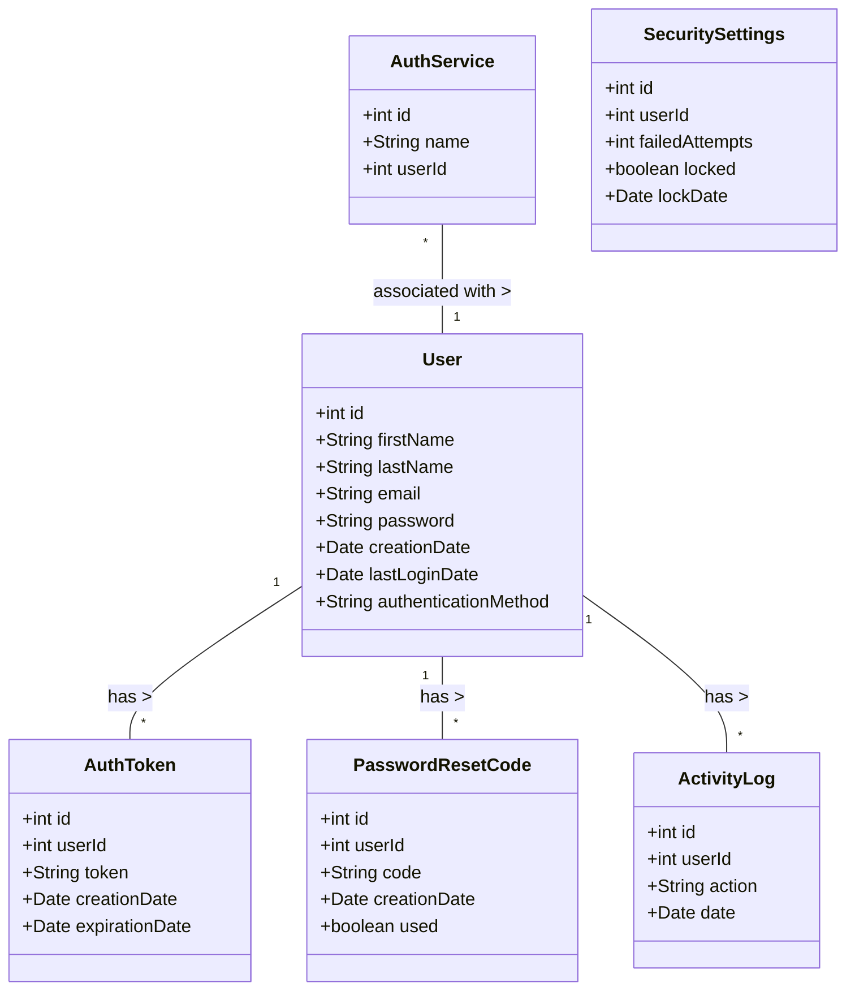

# .

## Context.md


## CreateContext.py

import os

def read_files_in_directory(directory):
    # Crear o abrir el archivo markdown
    with open('Context.md', 'w', encoding='utf-8') as md_file:
        # Recorrer el directorio
        for root, dirs, files in os.walk(directory):
            # Escribir el título de la carpeta
            folder_name = os.path.basename(root)
            md_file.write(f"# {folder_name}\n\n")

            # Leer y escribir el contenido de los archivos de texto
            for file in files:
                file_path = os.path.join(root, file)
                with open(file_path, 'r', encoding='utf-8') as f:
                     content = f.read()
                     md_file.write(f"## {file}\n\n")
                     md_file.write(content + "\n\n")
            md_file.write("\n---\n\n")  # Separador entre carpetas

if __name__ == "__main__":
    directory_to_scan = input("Introduce el directorio que deseas escanear: ")
    read_files_in_directory(directory_to_scan)
    print("El archivo Context.md ha sido creado.")

## documents

# Documentación del Proyecto de Aplicación de Login

## Tabla de Contenidos
├───01_Introduction
├───02_entities
├───03_diagrams
│   ├───Activities
│   ├───Sequences
│   └───UsesCases
├───04_relationships
└───examples


---

# 01_Introduction

## ProjectDescription

# Project Introduction

## Project Title: User Authentication Application

### Introduction

The User Authentication Application is a web-based solution designed to facilitate user registration, login, password recovery, and secure authentication using various third-party services such as Google, Facebook, and Outlook. This application aims to provide a seamless and secure experience for users while ensuring robust security measures are in place to protect sensitive information.

### Objectives

1. **User Registration**: Allow users to create new accounts easily and securely through a user-friendly registration form.
   
2. **User Login**: Enable users to log in to their accounts using their email and password or through third-party authentication services.

3. **Password Recovery**: Provide a secure method for users to recover their passwords via email verification and one-time codes.

4. **Secure Authentication**: Implement JSON Web Token (JWT) for secure session management and authentication.

5. **Activity Logging**: Maintain logs of user activities for monitoring and security purposes.

6. **Security Measures**: Incorporate security features to prevent common attacks, such as SQL injection and brute force attacks.

### Complete Description

The User Authentication Application is built using a modern tech stack that includes Flask for the backend and React for the frontend. The backend will utilize Flask-SQLAlchemy for database interactions with MySQL, allowing for efficient data management and retrieval. Flask-Migrate will be implemented for database migrations, ensuring that the application can evolve over time without losing data integrity.

On the frontend, React will provide a dynamic and responsive user interface, enhanced by Material-UI for visually appealing components. Redux will be used for state management, ensuring that the application's state is predictable and easy to manage.

The application will feature a comprehensive user management system that includes:

- **User Profiles**: Each user will have a profile that stores their personal information and preferences.
- **Third-Party Authentication**: Users will have the option to log in using their existing accounts from Google, Facebook, or Outlook, streamlining the authentication process.
- **Email Notifications**: Users will receive email notifications for account verification, password recovery, and other important actions.

The application will also prioritize security, implementing measures such as password hashing, rate limiting, and input validation to safeguard user data.

In summary, the User Authentication Application aims to provide a secure, efficient, and user-friendly platform for managing user accounts and authentication processes. By leveraging modern technologies and best practices in security, this application will ensure a reliable experience for all users.


---

# 02_entities

## ActivityLog.md

## ActivityLog Entity 
 
### Definition 
The  ActivityLog  entity records actions taken by users within the application for auditing and monitoring purposes. 
 
### Attributes 
 
- **id**:  
  - Type:  int  
  - Description: Unique identifier for the activity log entry. 
 
- **user_id**:  
  - Type:  int  
  - Description: Reference to the associated user. 
 
- **action**:  
  - Type:  string  
  - Description: Description of the action taken (e.g., "login", "password reset"). 
 
- **timestamp**:  
  - Type:  datetime  
  - Description: The date and time when the action occurred. 
 
### Example of ActivityLog Entity in JSON Format
{
  "id": 1,
  "user_id": 1,
  "action": "login",
  "timestamp": "2023-10-15T15:30:00Z"
}

## AuthService.md

## AuthService Entity 
 
### Definition 
The  AuthService  entity represents third-party authentication services that can be used for user login, such as Google, Facebook, or Outlook. 
 
### Attributes 
 
- **id**:  
  - Type:  int  
  - Description: Unique identifier for the authentication service. 
 
- **name**:  
  - Type:  string  
  - Description: The name of the authentication service (e.g., "Google", "Facebook"). 
 
- **user_id**:  
  - Type:  int  
  - Description: Reference to the associated user (if applicable). 
 
### Example of AuthService Entity in JSON Format
{
  "id": 1,
  "name": "Google",
  "user_id": 1
}

## AuthToken.md

### Definition 
The  AuthToken  entity represents a token generated for user authentication. This token is used to verify the user's identity during API requests. 
 
### Attributes 
 
- **id**:  
  - Type:  int  
  - Description: Unique identifier for the authentication token. 
 
- **user_id**:  
  - Type:  int  
  - Description: Reference to the associated user. 
 
- **token**:  
  - Type:  string  
  - Description: The JWT token generated for the user. 
 
- **created_at**:  
  - Type:  datetime  
  - Description: The date and time when the token was created. 
 
- **expiration_date**:  
  - Type:  datetime  
  - Description: The date and time when the token expires. 
 
### Example of AuthToken Entity in JSON Format
{
  "id": 1,
  "user_id": 1,
  "token": "jwt_token_string",
  "created_at": "2023-10-01T12:00:00Z",
  "expiration_date": "2023-10-01T13:00:00Z"
}

## PasswordResetCode.md

## PasswordResetCode Entity 
 
### Definition 
The  PasswordResetCode  entity represents a code sent to users for the purpose of resetting their passwords. 
 
### Attributes 
 
- **id**:  
  - Type:  int  
  - Description: Unique identifier for the password reset code. 
 
- **user_id**:  
  - Type:  int  
  - Description: Reference to the associated user. 
 
- **code**:  
  - Type:  string  
  - Description: The code sent to the user for password reset. 
 
- **created_at**:  
  - Type:  datetime  
  - Description: The date and time when the code was created. 
 
- **used**:  
  - Type:  boolean  
  - Description: Indicates whether the code has been used. 
 
### Example of PasswordResetCode Entity in JSON Format
{
  "id": 1,
  "user_id": 1,
  "code": "reset_code_string",
  "created_at": "2023-10-01T12:00:00Z",
  "used": false
}

## Rol.md

### Role Entity Design for Active Directory Integration

#### Entity: Role

**Definition**: The  `Role`  entity represents a set of permissions that can be assigned to users within the application. This entity is designed to be compatible with Active Directory (AD) integrations, allowing for seamless synchronization of roles between the application and AD.

#### Attributes

- **id**: 
  - Type:  `int` 
  - Description: Unique identifier for the role.

- **name**: 
  - Type:  `string` 
  - Description: The name of the role (e.g., "Administrator", "User", "Manager"). This should match the role names defined in Active Directory for consistency.

- **description**: 
  - Type:  `string` 
  - Description: A brief description of the role's purpose and permissions.

- **permissions**: 
  - Type:  `list` 
  - Description: A list of permissions associated with the role (e.g., "create_user", "delete_user", "view_reports"). This can be mapped to the permissions in Active Directory.

- **active_directory_group**: 
  - Type:  `string` 
  - Description: The name of the Active Directory group associated with this role. This allows for integration and synchronization with AD groups.

- **created_at**: 
  - Type:  `datetime` 
  - Description: The date and time when the role was created.

- **updated_at**: 
  - Type:  `datetime` 
  - Description: The date and time when the role was last updated.

#### Relationships

- **User**: 
  - A  `Role`  can be assigned to multiple users.
  - A  `User`  can have one or more roles.

### Example of Role Entity in JSON Format

Here's an example of how the  `Role`  entity might be represented in JSON format:
{
  "id": 1,
  "name": "Administrator",
  "description": "Full access to all system features and settings.",
  "permissions": [
    "create_user",
    "delete_user",
    "view_reports",
    "manage_roles"
  ],
  "active_directory_group": "AD_Administrators",
  "created_at": "2023-10-01T12:00:00Z",
  "updated_at": "2023-10-01T12:00:00Z"
}
### Integration with Active Directory

To ensure compatibility with Active Directory, the following considerations should be made:

1. **Role Synchronization**:
   - Implement a synchronization mechanism that periodically checks for changes in Active Directory groups and updates the roles in the application accordingly.

2. **Mapping Permissions**:
   - Define a mapping between application permissions and Active Directory permissions to ensure that users have the correct access based on their roles.

3. **Single Sign-On (SSO)**:
   - Utilize SSO capabilities to authenticate users against Active Directory, automatically assigning roles based on their AD group memberships.

4. **Role Management Interface**:
   - Provide an interface for administrators to manage roles, including creating, updating, and deleting roles, as well as assigning them to users.

### Conclusion

The  `Role`  entity design outlined above provides a robust framework for managing user roles within the application while ensuring compatibility with Active Directory. This design allows for efficient role management and seamless integration with existing enterprise systems. If you need further adjustments or additional details, feel free to ask!

## SecuritySettings.md

## SecuritySettings Entity 
 
### Definition 
The  SecuritySettings  entity manages security-related settings for each user, such as login attempts and account status. 
 
### Attributes 
 
- **id**:  
  - Type:  int  
  - Description: Unique identifier for the security settings. 
 
- **user_id**:  
  - Type:  int  
  - Description: Reference to the associated user. 
 
- **failed_attempts**:  
  - Type:  int  
  - Description: Number of failed login attempts. 
 
- **is_locked**:  
  - Type:  boolean  
  - Description: Indicates whether the user account is locked. 
 
- **lock_date**:  
  - Type:  datetime  
  - Description: The date and time when the account was locked. 
 
### Example of SecuritySettings Entity in JSON Format
{
  "id": 1,
  "user_id": 1,
  "failed_attempts": 3,
  "is_locked": true,
  "lock_date": "2023-10-01T12:00:00Z"
}

## User.md

### Definition 
The  User  entity represents an individual who can access the application. Each user has unique credentials and may belong to one or more roles. 
 
### Attributes 
 
- **id**:  
  - Type:  int  
  - Description: Unique identifier for the user. 
 
- **first_name**:  
  - Type:  string  
  - Description: The first name of the user. 
 
- **last_name**:  
  - Type:  string  
  - Description: The last name of the user. 
 
- **email**:  
  - Type:  string  
  - Description: The email address of the user (must be unique). 
 
- **password_hash**:  
  - Type:  string  
  - Description: The hashed password for the user's account. 
 
- **created_at**:  
  - Type:  datetime  
  - Description: The date and time when the user account was created. 
 
- **last_login**:  
  - Type:  datetime  
  - Description: The date and time when the user last logged in. 
 
- **authentication_method**:  
  - Type:  string  
  - Description: The method of authentication (e.g., local, Google, Facebook). 
 
### Example of User Entity in JSON Format
{
  "id": 1,
  "first_name": "John",
  "last_name": "Doe",
  "email": "john.doe@example.com",
  "password_hash": "hashed_password",
  "created_at": "2023-10-01T12:00:00Z",
  "last_login": "2023-10-15T15:30:00Z",
  "authentication_method": "local"
}

## UserRole.md


## UserRole Entity 
 
### Definition 
The  UserRole  entity serves as a join table to establish a many-to-many relationship between users and roles. 
 
### Attributes 
 
- **id**:  
  - Type:  int  
  - Description: Unique identifier for the user-role association. 
 
- **user_id**:  
  - Type:  int  
  - Description: Reference to the associated user. 
 
- **role_id**:  
  - Type:  int  
  - Description: Reference to the associated role. 
 
### Example of UserRole Entity in JSON Format
{
  "id": 1,
  "user_id": 1,
  "role_id": 1
}


---

# 03_diagrams

## Class.md

#Class Diagram




## States.md

```mermaid
stateDiagram-v2
    [*] --> Registered
    Registered --> LoggedIn : Login
    LoggedIn --> LoggedOut : Logout
    LoggedOut --> LoggedIn : Login
    LoggedIn --> PasswordReset : Request Password Reset
    PasswordReset --> LoggedOut : Reset Password
    PasswordReset --> LoggedIn : Cancel Reset
    LoggedOut --> Registered : Register

    ```


---

# Activities

## Admin_Roles.md

```mermaid
sequenceDiagram
    participant Admin
    participant Frontend
    participant Backend
    participant Database

    Admin->>Frontend: Accesses the roles management page
    Frontend->>Admin: Displays roles list and management options
    Admin->>Frontend: Chooses to create a new role
    Frontend->>Admin: Displays form for new role
    Admin->>Frontend: Fills out the form and submits
    Frontend->>Backend: Sends new role data
    Backend->>Database: Validates and creates new role
    Database-->>Backend: Confirms creation
    Backend->>Frontend: Sends success message
    Frontend->>Admin: Displays success notification

    Admin->>Frontend: Chooses to edit an existing role
    Frontend->>Admin: Displays form for editing role
    Admin->>Frontend: Modifies the role and submits
    Frontend->>Backend: Sends updated role data
    Backend->>Database: Validates and updates role
    Database-->>Backend: Confirms update
    Backend->>Frontend: Sends success message
    Frontend->>Admin: Displays success notification

    Admin->>Frontend: Chooses to delete a role
    Frontend->>Admin: Confirms deletion
    Admin->>Frontend: Confirms deletion
    Frontend->>Backend: Sends delete request for the role
    Backend->>Database: Deletes the role
    Database-->>Backend: Confirms deletion
    Backend->>Frontend: Sends success message
    Frontend->>Admin: Displays success notification
    ```

## LogOut.md

```mermaid
graph TD
    A[Start] --> B[Access Dashboard]
    B --> C[Click Logout]
    C --> D[Invalidate JWT Token]
    D --> E[Redirect to Login Page]
    E --> F[End]
    ```

## Password_Recovery.md

```mermaid
graph TD
    A[Start] --> B[Access Password Reset Page]
    B --> C[Enter Email]
    C --> D[Submit Request]
    D --> E[Generate Reset Code]
    E --> F[Send Reset Code to Email]
    F --> G[Access Reset Code Page]
    G --> H[Enter Reset Code and New Password]
    H --> I[Submit New Password]
    I --> J[Validate Reset Code]
    J -->|Valid| K[Update Password]
    J -->|Invalid| L[Show Error Message]
    K --> M[Send Confirmation Email]
    M --> N[Redirect to Login Page]
    L --> G
    N --> O[End]
    ```

## User_Login.md

```mermaid
graph TD
    A[Start] --> B[Access Login Page]
    B --> C[Enter Email and Password]
    C --> D[Submit Login]
    D --> E[Validate Credentials]
    E -->|Valid| F[Generate JWT Token]
    E -->|Invalid| G[Show Error Message]
    F --> H[Redirect to Dashboard]
    G --> B
    H --> I[End]
    ```

## User_Registration.md

```mermaid
graph TD
    A[Start] --> B[Access Registration Page]
    B --> C[Fill Registration Form]
    C --> D[Submit Form]
    D --> E[Validate Data]
    E -->|Valid| F[Create User Account]
    E -->|Invalid| G[Show Error Message]
    F --> H[Send Confirmation Email]
    H --> I[Redirect to Login Page]
    G --> B
    I --> J[End]
    ```


---

# Sequences

## Admin_Roles.md

```mermaid
sequenceDiagram
    participant Admin
    participant Frontend
    participant Backend
    participant Database

    Admin->>Frontend: Accesses the roles management page
    Frontend->>Admin: Displays roles list and management options
    Admin->>Frontend: Chooses to create a new role
    Frontend->>Admin: Displays form for new role
    Admin->>Frontend: Fills out the form and submits
    Frontend->>Backend: Sends new role data
    Backend->>Database: Validates and creates new role
    Database-->>Backend: Confirms creation
    Backend->>Frontend: Sends success message
    Frontend->>Admin: Displays success notification

    Admin->>Frontend: Chooses to edit an existing role
    Frontend->>Admin: Displays form for editing role
    Admin->>Frontend: Modifies the role and submits
    Frontend->>Backend: Sends updated role data
    Backend->>Database: Validates and updates role
    Database-->>Backend: Confirms update
    Backend->>Frontend: Sends success message
    Frontend->>Admin: Displays success notification

    Admin->>Frontend: Chooses to delete a role
    Frontend->>Admin: Confirms deletion
    Admin->>Frontend: Confirms deletion
    Frontend->>Backend: Sends delete request for the role
    Backend->>Database: Deletes the role
    Database-->>Backend: Confirms deletion
    Backend->>Frontend: Sends success message
    Frontend->>Admin: Displays success notification
    ```

## Password_Recovery.md

```mermaid
sequenceDiagram
    participant User
    participant Frontend
    participant Backend
    participant Database
    participant Email

    User->>Frontend: Accesses the password recovery page
    Frontend->>User: Displays recovery form
    User->>Frontend: Enters email
    Frontend->>Backend: Sends recovery request
    Backend->>Database: Checks if the email exists
    Database-->>Backend: Returns result
    alt Email exists
        Backend->>Database: Generates recovery code
        Database-->>Backend: Confirms generation
        Backend->>Email: Sends recovery code
        Email-->>Backend: Confirms sending
        Backend->>Frontend: Sends success message
        Frontend->>User: Displays success message
    else Email does not exist
        Backend->>Frontend: Sends error for email not found
        Frontend->>User: Displays error message
    end
    ```

## User_Login.md

```mermaid
sequenceDiagram
    participant User
    participant Frontend
    participant Backend
    participant Database

    User->>Frontend: Accesses the login page
    Frontend->>User: Displays login form
    User->>Frontend: Enters email and password
    Frontend->>Backend: Sends credentials
    Backend->>Database: Verifies credentials
    Database-->>Backend: Returns result
    alt Valid credentials
        Backend->>Frontend: Sends JWT token
        Frontend->>User: Redirects to main page
    else Invalid credentials
        Backend->>Frontend: Sends error for invalid credentials
        Frontend->>User: Displays error message
    end
    ```

## User_Registration.md

```mermaid
sequenceDiagram
    participant User
    participant Frontend
    participant Backend
    participant Database

    User->>Frontend: Accesses the registration page
    Frontend->>User: Displays registration form
    User->>Frontend: Fills out form and submits
    Frontend->>Backend: Sends registration data
    Backend->>Database: Checks if the email already exists
    Database-->>Backend: Returns result
    alt Email does not exist
        Backend->>Database: Creates new user
        Database-->>Backend: Confirms creation
        Backend->>Frontend: Sends registration confirmation
        Frontend->>User: Displays success message
    else Email already exists
        Backend->>Frontend: Sends error for existing email
        Frontend->>User: Displays error message
    end
    ```


---

# UsesCases

## Admin_Roles.md

```mermaid 
%%{init: {'theme': 'default'}}%%
graph TD
    A[Admin User] -->|Accesses administration view| B[Administration System]
    B -->|Selects Manage Roles| C[Display List of Roles]
    C --> D{Options}
    D -->|Create New Role| E[Create Role Form]
    E -->|Submits Role Details| F[Validate Input]
    F -->|Valid| G[Create New Role]
    G -->|Adds to List| C
    D -->|Update Existing Role| H[Select Role]
    H -->|Modify Role Details| I[Update Role Form]
    I -->|Submits Changes| F
    F -->|Valid| J[Update Role]
    J -->|Reflects Changes| C
    D -->|Delete Role| K[Select Role]
    K -->|Confirm Deletion| L[Delete Role]
    L -->|Removes from List| C
    D -->|Assign Roles to Users| M[Select Role]
    M -->|Display Users| N[Assign Users]
    N -->|Submits Assignments| O[Update User Roles]
    ```

## Password_Recovery.md

```mermaid 
%%{init: {'theme': 'default'}}%%
graph TD
    A[User] -->|Requests password recovery| B[Recovery System]
    B -->|Sends recovery email| C[Email Service]
    C -->|Email Sent| D[Show Recovery Success Message]
    A -->|Enters recovery code| E[Recovery Code Validation]
    E -->|Validates code| F{Code Valid?}
    F -->|Yes| G[Allows User to Set New Password]
    F -->|No| H[Show Invalid Code Message]
    ```

## User_Login.md

```mermaid 
%%{init: {'theme': 'default'}}%%
graph TD
    A[User] -->|Enters email and password| B[Login System]
    B -->|Validates credentials| C{Credentials Valid?}
    C -->|Yes| D[Generate JWT Token]
    C -->|No| E[Show Error Message]
    D -->|Redirects to main page| F[Main Application]
```

## User_Registration.md

```mermaid 
%%{init: {'theme': 'default'}}%%
graph TD
    A[User] -->|Submits registration form| B[Registration System]
    B -->|Validates input| C{Input Valid?}
    C -->|Yes| D[Create User Account]
    C -->|No| E[Show Error Message]
    D -->|Sends confirmation email| F[Email Service]
    F -->|Email Sent| G[Show Success Message]
    ```


---

# 04_relationships

## description

## Relationships Between Entities
- A `User` can have multiple `AuthTokens`.
- A `User` can have multiple `PasswordResetCodes`.
- A `User` can have multiple `ActivityLogs`.
- An `AuthService` can be associated with a single `User`.


---

# examples


---

