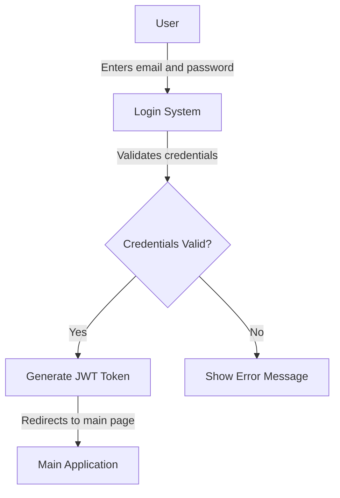

```mermaid 
%%{init: {'theme': 'default'}}%%
graph TD
    A[User] -->|Enters email and password| B[Login System]
    B -->|Validates credentials| C{Credentials Valid?}
    C -->|Yes| D[Generate JWT Token]
    C -->|No| E[Show Error Message]
    D -->|Redirects to main page| F[Main Application]
```